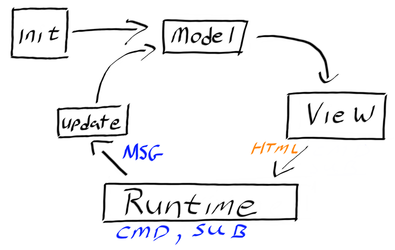

- title : Full Fun Web with SAFE Stack
- description : Introduction to the SAFE web stack.
- author : Shane Charles
- theme : night
- transition : default

***

### Full Fun Web with SAFE Stack

***

<!-- .slide: class="two-floating-elements" -->
### About me

    <ul>
     <li>Shane Charles</li>
<li>White Light Computing, Inc.</li>
<li>Functional programming enthusiast</li>
<li>Board member for Winnipeg .Net UG</li>
</ul>

    type ContactType = | Twitter | Blog | GitHub

    let getContactInfo = function
      | Twitter -> "@dead_stroke"
      | Blog    -> "https://geekeh.com"
      | GitHub  -> "shanecharles"

***

### You will see

- What is SAFE Stack
- Setup
- Fable + Elmish
- Saturn
- Azure
- Summary

***

### You will not see

- Nice Aesthetics
- Good UX
- Any Security

***
### SAFE Stack

- Web Stack
- F# in the front
- F# in the back

---
### SAFE History

- Server
- Azure
- Fable
- Elmish

---

### Server?

- Suave
- Azure
- Fable
- Elmish

---

### + Giraffe

- `choose [suave; giraffe]`
- Azure
- Fable
- Elmish

---
### + Saturn

- `choose [suave; giraffe; saturn]`
- Azure
- Fable
- Elmish

---

### No Longer Suave

- `choose [giraffe; saturn]`
- Azure
- Fable
- Elmish

---

### Current SAFE Defaults

- Saturn
- Azure
- Fable
- Elmish

***
### Setup Requirements

- dotnet core (2.+)
- `yarn` and `node`
- `fake` command line tool

---
### Installing Fake

> dotnet tool install fake-cli -g

- Linux/OSx: `~/.dotnet/tools`
- Windows: `%USERPROFILE%\.dotnet\tools`

---

### Installing and Running SAFE 

- Command Line
 - dotnet new -i SAFE.Template
 - dotnet new SAFE
 - fake build --target run

***

### Fable 

- F# to javascript compiler
- Not limited to SAFE Stack
 - can be used independently
- Recently released version 2

---
### Elmish

- front-end paradigm 
- Elm Architecture
 - Model
 - View
 - Update

---
### Flow

---
### Notifications

- Messages: Strongly typed 
- Commands: state events
- Subscriptions: external events

---
### Flow State

---
### Required Functions

- init
- update
- view
  
---
### CSS

- Fulma
 - Bulma bindings
 - based on Flexbox
 - modifiers use a prefix 
  - `is-`
  - `has-`

---
### Demos
***

### Saturn

- Standalone Server
- Abstraction on Giraffe
- Inspired by Phoenix (Elixir)
- MVC pattern

---
### Opinionated 

- Convention over configuration
 - Dapper
 - Simple.Migrations
- Scaffolding scripts
 - `dotnet saturn` command line tool

---
### Computation Expressions

- pipeline
- controller
- router
 - formerly `scope`

---
### Router functions

- pipe_through
- get, getf
- post
- forward

***
### Deploy to Azure

- Docker
- App Service
 - Create azure enabled project
 - dotnet new SAFE --deploy azure

---
### Azure App Service Setup

- Azure Active Directory
- Create new App Registration
 - Required Permissions
  - Enable "Windows Azure Service Management API"
 - Copy Application ID

---
### Application Directory

    fake build --target appservice 
        -e subscriptionId={azure subscripton id} 
        -e clientId={application id} 
        -e environment={postfix - prdc2018}
        -e location=eastus

---
### More Detailed Instructions

- Azure Active Directory App Registration
 - https://safe-stack.github.io/docs/template-azure-registration/#creating-an-app-registration
- Detailed deploy instructions
 - https://safe-stack.github.io/docs/template-appservice/

***
### Summary

- SAFE Stack
 - Still early but powerful
 - Azure deployments
 - Community driven

- Elmish
 - Model-View-Update architecture

- Saturn
 - Model-View-Controller

***
### Extra Resources

- https://safe-stack.github.io
- https://elmish.github.io
- https://saturnframework.org
- http://fable.io/repl/

***

### Thank You

    type ContactType = | Twitter | Blog | GitHub

    let getContactInfo = function
      | Twitter -> "@dead_stroke"
      | Blog    -> "https://geekeh.com"
      | GitHub  -> "shanecharles"

***
